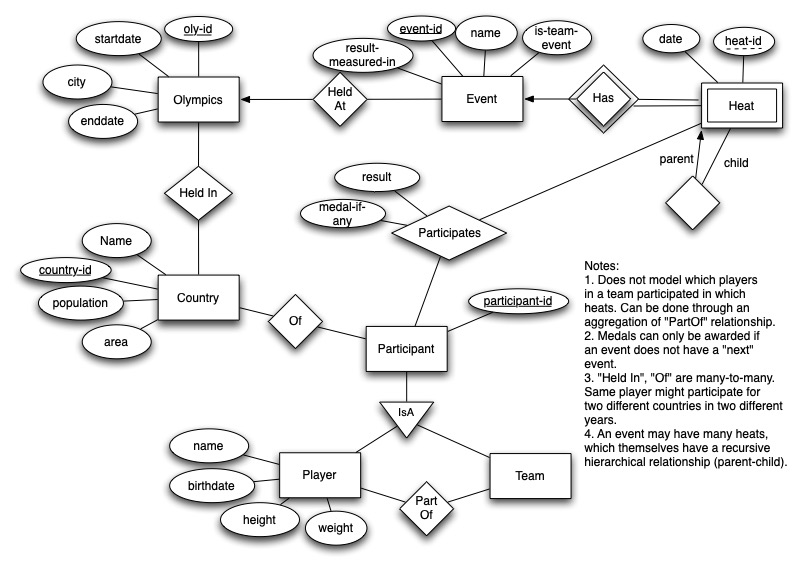

# Examples of E/R Models from Previous Classes

## Neilsen Database
You are asked to design a database that would help Nielsen Media Research maintain information about TV watching habits of viewers. Construct an E/R diagram for this database.

Possible entity sets include: TV Channel, TV Series, Episode, Viewer Name etc. A viewer may watch part of one show, and part of another (this would probably be the hardest thing to model). The exact amount of time (in minutes) that a user watched a show must be somehow modeled (this doesn't have to be done explicitly, but it should be possible to extract that information from whatever data is actually stored). Make any simplifying assumptions you need to make (and state them).

Some things you need to model, and watch out for:
- The information about "when" a particular episode was aired must be modeled.
- Remember that a given episode may air at multiple times.
- Episode numbers or episode names are not unique across TV Serieses.
- The database should be able to answer the queries such as: how many viewers watched at least 50% of the Sept 5 premier of "House MD" ?  
- A viewer may watch only one show at any time.

A possible solution: Note that both started-watching and stopped-watching are multi-valued, to capture the fact that the user may switch back and forth between TV channels.

## Olympics
You are asked to design a database that for storing information about the Summer Olympics, the sports, 
who won the medals, when the events were conducted, the results etc. Construct an E/R diagram for this database.

Possible entity sets include: Country, Player, Event etc. Make any simplifying assumptions you need to make
(and state them). You should have about 5-6 entity sets.

Some things you need to model, and watch out for:
- Many events have prelinimary ``heats'' (e.g. 100m), and there should be a way to model this information.
- Several of the events are ``team'' events, with the size of the team usually being 4, and all of them are awarded the same medal; however more medals might be awarded if the team members participating in the heats differ from the team members participating in the final.
- You should be able to answer questions like ``what was the progression of winning times over last 100 years for 200m running'' ? 
- Take a look at this website for more information about types of data that needs to be stored http://www.databaseolympics.com/.

